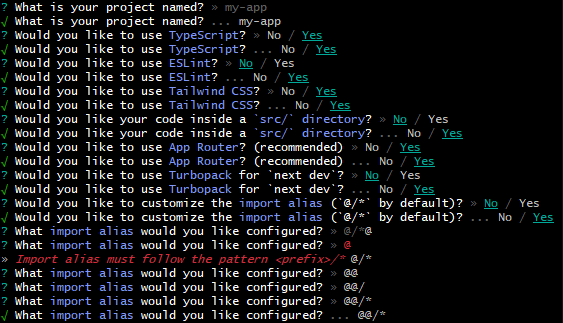
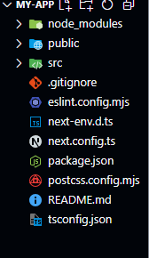

## Imp bullets from documentation
Next.js is a React framework for building full-stack web applicationsYou use React Components to build user interfaces, and Next.js for additional features and optimizations.


## imp features
| Feature        | Description |
|---------------|-------------|
| Routing       | A file-system based router built on top of Server Components that supports layouts, nested routing, loading states, error handling, and more. |
| Rendering     | Client-side and Server-side Rendering with Client and Server Components. Further optimized with Static and Dynamic Rendering on the server with Next.js. Streaming on Edge and Node.js runtimes. |
| Data Fetching | Simplified data fetching with async/await in Server Components, and an extended fetch API for request memoization, data caching, and revalidation. |
| Styling       | Support for your preferred styling methods, including CSS Modules, Tailwind CSS, and CSS-in-JS. |
| Optimizations | Image, Fonts, and Script Optimizations to improve your application's Core Web Vitals and User Experience. |
| TypeScript    | Improved support for TypeScript, with better type checking and more efficient compilation, as well as a custom TypeScript Plugin and type checker. |


## Pre-Requisite Knowledge
Although our docs are designed to be beginner-friendly, we need to establish a baseline so that the docs can stay focused on Next.js functionality. We'll make sure to provide links to relevant documentation whenever we introduce a new concept.

To get the most out of our docs, it's recommended that you have a basic understanding of HTML, CSS, and React.

## Installation 
System requirements
Node.js 18.18 or later.
macOS, Windows (including WSL), and Linux are supported.
1- `npx create-next-app@latest`
2- `What is your project named? my-app`
`Would you like to use TypeScript? No / Yes`
`Would you like to use ESLint? No / Yes`
`Would you like to use Tailwind CSS? No / Yes`
`Would you like your code inside a `src/` directory? No / Yes`
`Would you like to use App Router? (recommended) No / Yes`
`Would you like to use Turbopack for `next dev`?  No / Yes`
`Would you like to customize the import alias (`@/*` by default)? No / Yes`
`What import alias would you like configured? @/*`



## Project Structre
### Top-level folders
```
  
-public (Static assets to be served)
-src (Optional application source folder)
    -/app (App Router)
    -/pages (Pages Router)

```
### Top-level files
Top-level files are used to configure your application, manage dependencies, run middleware, integrate monitoring tools, and define environment variables.


| File                 | Description                                      |
|----------------------|--------------------------------------------------|
| `next.config.js`     | Configuration file for Next.js                  |
| `package.json`      | Project dependencies and scripts                 |
| `instrumentation.ts`| OpenTelemetry and Instrumentation file           |
| `middleware.ts`     | Next.js request middleware                       |
| `.env`             | Environment variables                            |
| `.env.local`       | Local environment variables                      |
| `.env.production`  | Production environment variables                 |
| `.env.development` | Development environment variables                |
| `.eslintrc.json`   | Configuration file for ESLint                    |
| `.gitignore`       | Git files and folders to ignore                  |
| `next-env.d.ts`    | TypeScript declaration file for Next.js           |
| `tsconfig.json`    | Configuration file for TypeScript                |
| `jsconfig.json`    | Configuration file for JavaScript                |


## Routing

### Pages and Layouts
- pages directory
  - When a file is added to the pages directory, it's automatically available as a route.
  - 
        Example: If you create pages/about.js that exports a React component like below, it will be accessible at /about.
- Index routes
  - The router will automatically route files named index to the root of the directory.

        pages/index.js → /
        pages/blog/index.js → /blog


 - Nested routes
   - The router supports nested files. If you create a nested folder structure, files will automatically be routed in the same way still.

            pages/blog/first-post.js → /blog/first-post
            pages/dashboard/settings/username.js → /dashboard/settings/username
    
- Pages with Dynamic Routes
  
| Convention            | File Extensions      | Description                          |
|-----------------------|---------------------|--------------------------------------|
| **Folder convention** |                     |                                      |
| `[folder]/index`      | `.js`, `.jsx`, `.tsx` | Dynamic route segment               |
| `[...folder]/index`   | `.js`, `.jsx`, `.tsx` | Catch-all route segment             |
| `[[...folder]]/index` | `.js`, `.jsx`, `.tsx` | Optional catch-all route segment    |
| **File convention**   |                     |                                      |
| `[file]`             | `.js`, `.jsx`, `.tsx` | Dynamic route segment               |
| `[...file]`          | `.js`, `.jsx`, `.tsx` | Catch-all route segment             |
| `[[...file]]`        | `.js`, `.jsx`, `.tsx` | Optional catch-all route segment    |


### Layout Pattern (reusablity)
- The React model allows us to deconstruct a page into a series of components. Many of these components are often reused between pages. For example, you might have the same navigation bar and footer on every page.
 
 ``` import Navbar from './navbar'
import Footer from './footer'
 
export default function Layout({ children }) {
  return (
    <>
      <Navbar />
      <main>{children}</main>
      <Footer />
    </>
  )
}
```


## Custom App

Next.js uses the App component to initialize pages. You can override it and control the page initialization and:

- Create a shared layout between page changes
- Inject additional data into pages
- Add global CSS
  
EXAMPLE

To override the default App, create the file pages/_app as shown below:
```
import type { AppProps } from 'next/app'
 
export default function MyApp({ Component, pageProps }: AppProps) {
  return <Component {...pageProps} />
}
```
The `Component` prop is the active `page`, so whenever you navigate between routes, `Component` will change to the new page. Therefore, any props you send to` Component` will be received by the `page`.

`pageProps` is an object with the initial props that were preloaded for your page by one of our data fetching methods, otherwise it's an empty object.

> If your app is running and you added a custom App, you'll need to restart the development server. Only required if pages/_app.js didn't exist before.

> App does not support Next.js Data Fetching methods like getStaticProps or getServerSideProps.


## REST HTTP REQUESTS REFERENCES
- HuXn WebDev : https://youtu.be/QIDkK0FbXDc?si=eXQijTFsx9g305qw&t=14455

- Documentation: https://nextjs.org/docs/app/building-your-application/routing/route-handlers
- Form and Action by leerob (from the documentation):  https://www.youtube.com/watch?v=dDpZfOQBMaU

- Documentation : https://nextjs.org/docs/app/examples

- Documentation : https://nextjs.org/docs/app/getting-started/updating-data