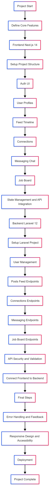
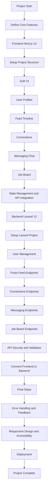

# Next.js 14 Documentation – Table of Contents

- [Introduction](#introduction)
- [Installation](#installation)
- [Project Structure](#project-structure)
- [Routing](#routing)
- [Layouts](#layouts)
- [Rendering](#rendering)
- [Data Fetching](#data-fetching)
- [Styling](#styling)
- [Optimizations](#optimizations)
- [TypeScript Support](#typescript-support)
- [Custom App](#custom-app)
- [API Routes](#api-routes)
- [Middleware](#middleware)
- [Environment Variables](#environment-variables)
- [Deployment](#deployment)
- [Learn More](#learn-more)
- [Project Road Map: HR Professionals Platform](#project-road-map-hr-professionals-platform)

---

## Introduction

Next.js is a React framework for building full-stack web applications, offering features like file-based routing, server-side rendering, static site generation, and API routes.

**Example:**

```jsx
export default function Home() {
  return <h1>Hello, Next.js 14!</h1>;
}
```

[Learn more](https://nextjs.org/docs)

---

## Installation

Install Node.js 18.18+ and run:

```bash
npx create-next-app@latest
```

Follow the prompts to set up your project (TypeScript, Tailwind, etc.).

[Learn more](https://nextjs.org/docs/getting-started/installation)

---

## Project Structure

Next.js uses a file-system based router. Key folders/files:

- `/pages` or `/app`: Routing entry points
- `/public`: Static assets
- `next.config.js`: Configuration

**Example:**

```
my-app/
  pages/
    index.js
    about.js
  public/
    logo.png
  next.config.js
```

[Learn more](https://nextjs.org/docs/app/building-your-application/directory-structure)

---

## Routing

File-based routing: files in `/pages` or `/app` become routes.

**Example:**

- `pages/about.js` → `/about`
- `pages/blog/[id].js` → `/blog/:id`

Dynamic routes:

```jsx
// pages/blog/[id].js
import { useRouter } from "next/router";
export default function Blog() {
  const router = useRouter();
  return <p>Blog: {router.query.id}</p>;
}
```

[Learn more](https://nextjs.org/docs/app/building-your-application/routing)

---

## Layouts

Reusable layouts for consistent UI (e.g., navbars, footers).

**Example:**

```jsx
export default function Layout({ children }) {
  return (
    <>
      <Navbar />
      <main>{children}</main>
      <Footer />
    </>
  );
}
```

[Learn more](https://nextjs.org/docs/app/building-your-application/routing/pages-and-layouts)

---

## Rendering

Supports Static Generation (SSG), Server-side Rendering (SSR), and Client-side Rendering (CSR).

**Example:**

```jsx
// SSG
export async function getStaticProps() {
  return { props: { data: "static" } };
}

// SSR
export async function getServerSideProps() {
  return { props: { data: "server" } };
}
```

[Learn more](https://nextjs.org/docs/app/building-your-application/rendering)

---

## Data Fetching

Fetch data at build time, request time, or on the client.

**Example:**

```jsx
// Server Component (app directory)
export default async function Page() {
  const res = await fetch("https://api.example.com/data");
  const data = await res.json();
  return <div>{data.value}</div>;
}
```

[Learn more](https://nextjs.org/docs/app/building-your-application/data-fetching)

---

## Styling

Supports CSS Modules, Tailwind CSS, CSS-in-JS, and more.

**Example:**

```css
/* styles/Home.module.css */
.title {
  color: blue;
}
```

```jsx
import styles from "./Home.module.css";
export default function Home() {
  return <h1 className={styles.title}>Hello</h1>;
}
```

[Learn more](https://nextjs.org/docs/app/building-your-application/styling)

---

## Optimizations

Built-in image, font, and script optimizations.

**Example:**

```jsx
import Image from "next/image";
export default function Avatar() {
  return <Image src="/avatar.png" width={100} height={100} alt="avatar" />;
}
```

[Learn more](https://nextjs.org/docs/app/building-your-application/optimizing)

---

## TypeScript Support

First-class TypeScript support.

**Example:**

```tsx
type Props = { name: string };
export default function Welcome({ name }: Props) {
  return <h1>Hello, {name}</h1>;
}
```

[Learn more](https://nextjs.org/docs/app/building-your-application/configuring/typescript)

---

## Custom App

Override the default App component for global layouts or state.

**Example:**

```tsx
// pages/_app.tsx
import type { AppProps } from "next/app";
export default function MyApp({ Component, pageProps }: AppProps) {
  return <Component {...pageProps} />;
}
```

[Learn more](https://nextjs.org/docs/pages/building-your-application/routing/custom-app)

---

## API Routes

Create API endpoints in `/pages/api`.

**Example:**

```js
// pages/api/hello.js
export default function handler(req, res) {
  res.status(200).json({ message: "Hello from API" });
}
```

[Learn more](https://nextjs.org/docs/pages/building-your-application/routing/api-routes)

---

## Middleware

Run code before a request is completed (e.g., auth, redirects).

**Example:**

```js
// middleware.ts
import { NextResponse } from "next/server";
export function middleware(request) {
  return NextResponse.next();
}
```

[Learn more](https://nextjs.org/docs/app/building-your-application/routing/middleware)

---

## Environment Variables

Use `.env.local`, `.env.production`, etc.

**Example:**

```
NEXT_PUBLIC_API_URL=https://api.example.com
```

```js
const url = process.env.NEXT_PUBLIC_API_URL;
```

[Learn more](https://nextjs.org/docs/app/building-your-application/configuring/environment-variables)

---

## Deployment

Deploy to Vercel or any Node.js server.

**Example:**

```bash
npm run build
npm start
```

[Learn more](https://nextjs.org/docs/app/building-your-application/deploying)

---

## Learn More

- [Next.js Documentation](https://nextjs.org/docs)
- [Next.js 14 Release Notes](https://nextjs.org/blog/next-14)

---

## What Else Should You Know to Build a Real-World Next.js Project?

The above sections cover the core concepts of Next.js 14. For most projects, these are the essentials. However, as your project grows or becomes more complex, you may need to learn about the following advanced topics:

### 1. Authentication & Authorization

Implement user login, protected routes, and role-based access.
[Learn more](https://nextjs.org/docs/app/building-your-application/authentication)

### 2. State Management

Use React Context, Redux, Zustand, or other libraries for global state.
[Learn more](https://nextjs.org/docs/app/building-your-application/data-fetching/client-components#using-client-context)

### 3. Forms & Validation

Handle forms, validation, and error messages.
[Learn more](https://nextjs.org/docs/app/building-your-application/data-fetching/forms-and-mutations)

### 4. Testing

Unit, integration, and end-to-end testing (Jest, React Testing Library, Cypress, Playwright).
[Learn more](https://nextjs.org/docs/app/building-your-application/testing)

### 5. Performance & Analytics

Measure and optimize performance, use analytics and monitoring tools.
[Learn more](https://nextjs.org/docs/app/building-your-application/optimizing/performance)

### 6. Internationalization (i18n)

Support multiple languages/locales.
[Learn more](https://nextjs.org/docs/app/building-your-application/configuring/internationalization)

### 7. Advanced API/Backend Integration

Connect to databases, external APIs, or use serverless functions.
[Learn more](https://nextjs.org/docs/app/building-your-application/data-fetching/server-actions)

### 8. Edge Functions & Middleware

Run code at the edge for lower latency and advanced routing.
[Learn more](https://nextjs.org/docs/app/building-your-application/routing/middleware)

### 9. Custom Error Handling

Custom 404, 500, and error boundaries.
[Learn more](https://nextjs.org/docs/app/building-your-application/routing/pages-and-layouts#error-handling)

### 10. CI/CD & Deployment Strategies

Automate deployment, use preview environments, and manage environments.
[Learn more](https://nextjs.org/docs/app/building-your-application/deploying)

**Tip:** Start with the basics, build a simple project, and as you encounter new requirements, refer to the [Next.js documentation](https://nextjs.org/docs) for deeper or more advanced topics.

---

## Imp bullets from documentation

Next.js is a React framework for building full-stack web applicationsYou use React Components to build user interfaces, and Next.js for additional features and optimizations.

## imp features

| Feature       | Description                                                                                                                                                                                      |
| ------------- | ------------------------------------------------------------------------------------------------------------------------------------------------------------------------------------------------ |
| Routing       | A file-system based router built on top of Server Components that supports layouts, nested routing, loading states, error handling, and more.                                                    |
| Rendering     | Client-side and Server-side Rendering with Client and Server Components. Further optimized with Static and Dynamic Rendering on the server with Next.js. Streaming on Edge and Node.js runtimes. |
| Data Fetching | Simplified data fetching with async/await in Server Components, and an extended fetch API for request memoization, data caching, and revalidation.                                               |
| Styling       | Support for your preferred styling methods, including CSS Modules, Tailwind CSS, and CSS-in-JS.                                                                                                  |
| Optimizations | Image, Fonts, and Script Optimizations to improve your application's Core Web Vitals and User Experience.                                                                                        |
| TypeScript    | Improved support for TypeScript, with better type checking and more efficient compilation, as well as a custom TypeScript Plugin and type checker.                                               |

## Pre-Requisite Knowledge

Although our docs are designed to be beginner-friendly, we need to establish a baseline so that the docs can stay focused on Next.js functionality. We'll make sure to provide links to relevant documentation whenever we introduce a new concept.

To get the most out of our docs, it's recommended that you have a basic understanding of HTML, CSS, and React.

## Installation

System requirements
Node.js 18.18 or later.
macOS, Windows (including WSL), and Linux are supported.
1- `npx create-next-app@latest`
2- `What is your project named? my-app`
`Would you like to use TypeScript? No / Yes`
`Would you like to use ESLint? No / Yes`
`Would you like to use Tailwind CSS? No / Yes`
`Would you like your code inside a `src/` directory? No / Yes`
`Would you like to use App Router? (recommended) No / Yes`
`Would you like to use Turbopack for `next dev`?  No / Yes`
`Would you like to customize the import alias (`@/_` by default)? No / Yes`
`What import alias would you like configured? @/_`


## Project Structre

### Top-level folders

```

-public (Static assets to be served)
-src (Optional application source folder)
    -/app (App Router)
    -/pages (Pages Router)

```

### Top-level files

Top-level files are used to configure your application, manage dependencies, run middleware, integrate monitoring tools, and define environment variables.

| File                 | Description                             |
| -------------------- | --------------------------------------- |
| `next.config.js`     | Configuration file for Next.js          |
| `package.json`       | Project dependencies and scripts        |
| `instrumentation.ts` | OpenTelemetry and Instrumentation file  |
| `middleware.ts`      | Next.js request middleware              |
| `.env`               | Environment variables                   |
| `.env.local`         | Local environment variables             |
| `.env.production`    | Production environment variables        |
| `.env.development`   | Development environment variables       |
| `.eslintrc.json`     | Configuration file for ESLint           |
| `.gitignore`         | Git files and folders to ignore         |
| `next-env.d.ts`      | TypeScript declaration file for Next.js |
| `tsconfig.json`      | Configuration file for TypeScript       |
| `jsconfig.json`      | Configuration file for JavaScript       |

## Routing

### Pages and Layouts

- pages directory
  - When a file is added to the pages directory, it's automatically available as a route.
  -     Example: If you create pages/about.js that exports a React component like below, it will be accessible at /about.
- Index routes

  - The router will automatically route files named index to the root of the directory.

        pages/index.js → /
        pages/blog/index.js → /blog

- Nested routes

  - The router supports nested files. If you create a nested folder structure, files will automatically be routed in the same way still.

           pages/blog/first-post.js → /blog/first-post
           pages/dashboard/settings/username.js → /dashboard/settings/username

- Pages with Dynamic Routes

| Convention            | File Extensions       | Description                      |
| --------------------- | --------------------- | -------------------------------- |
| **Folder convention** |                       |                                  |
| `[folder]/index`      | `.js`, `.jsx`, `.tsx` | Dynamic route segment            |
| `[...folder]/index`   | `.js`, `.jsx`, `.tsx` | Catch-all route segment          |
| `[[...folder]]/index` | `.js`, `.jsx`, `.tsx` | Optional catch-all route segment |
| **File convention**   |                       |                                  |
| `[file]`              | `.js`, `.jsx`, `.tsx` | Dynamic route segment            |
| `[...file]`           | `.js`, `.jsx`, `.tsx` | Catch-all route segment          |
| `[[...file]]`         | `.js`, `.jsx`, `.tsx` | Optional catch-all route segment |

### Layout Pattern (reusablity)

- The React model allows us to deconstruct a page into a series of components. Many of these components are often reused between pages. For example, you might have the same navigation bar and footer on every page.

```import Navbar from './navbar'
import Footer from './footer'

export default function Layout({ children }) {
 return (
   <>
     <Navbar />
     <main>{children}</main>
     <Footer />
   </>
 )
}
```

## Custom App

Next.js uses the App component to initialize pages. You can override it and control the page initialization and:

- Create a shared layout between page changes
- Inject additional data into pages
- Add global CSS

EXAMPLE

To override the default App, create the file pages/\_app as shown below:

```
import type { AppProps } from 'next/app'

export default function MyApp({ Component, pageProps }: AppProps) {
  return <Component {...pageProps} />
}
```

The `Component` prop is the active `page`, so whenever you navigate between routes, `Component` will change to the new page. Therefore, any props you send to` Component` will be received by the `page`.

`pageProps` is an object with the initial props that were preloaded for your page by one of our data fetching methods, otherwise it's an empty object.

> If your app is running and you added a custom App, you'll need to restart the development server. Only required if pages/\_app.js didn't exist before.

> App does not support Next.js Data Fetching methods like getStaticProps or getServerSideProps.

## REST HTTP REQUESTS REFERENCES

- HuXn WebDev : https://youtu.be/QIDkK0FbXDc?si=eXQijTFsx9g305qw&t=14455

- Documentation: https://nextjs.org/docs/app/building-your-application/routing/route-handlers
- Form and Action by leerob (from the documentation): https://www.youtube.com/watch?v=dDpZfOQBMaU

- Documentation : https://nextjs.org/docs/app/examples

- Documentation : https://nextjs.org/docs/app/getting-started/updating-data

---

## Project Road Map: HR Professionals Platform



This roadmap will guide you in building a LinkedIn-like platform for HR professionals, focusing on the most important features. The process starts with the frontend (Next.js 14), then moves to the backend (PHP & Laravel 12).

### 1. Define Core Features (MVP)

- User authentication (sign up, login, logout)
- User profiles (basic info, photo, bio, HR specialization)
- Feed/timeline for posts (text, links, images)
- Connections (add/remove HR contacts)
- Messaging (simple direct messages)
- Job board (post and view HR-related jobs)

### 2. Frontend (Next.js 14)

**Step 1:** Set up Next.js 14 project structure

- Install Next.js 14
- Set up routing and layouts (public pages, dashboard, profile, jobs, messages)

**Step 2:** Authentication UI

- Build sign up, login, and logout pages
- Use forms and validation

**Step 3:** User Profile Pages

- Create profile view and edit pages
- Upload profile photo (use Next.js Image component)

**Step 4:** Feed/Timeline

- Build a feed page to display posts
- Create a form to add new posts

**Step 5:** Connections

- List HR professionals
- Add/remove connections (UI only for now)

**Step 6:** Messaging

- Simple chat UI for direct messages

**Step 7:** Job Board

- List jobs
- Form to post a new job

**Step 8:** State Management & API Integration

- Use React Context or a simple state library
- Prepare API calls (mock with static data or use fetch to backend endpoints)

### 3. Backend (PHP & Laravel 12)

**Step 1:** Set up Laravel 12 project

- Configure database (users, posts, connections, messages, jobs)
- Set up authentication (Laravel Breeze or Sanctum)

**Step 2:** User Management

- User registration, login, profile update endpoints

**Step 3:** Posts/Feed

- Endpoints to create, read, and list posts

**Step 4:** Connections

- Endpoints to add/remove connections
- List user's connections

**Step 5:** Messaging

- Endpoints for sending and retrieving direct messages

**Step 6:** Job Board

- Endpoints to post and list jobs

**Step 7:** API Security & Validation

- Protect routes (auth middleware)
- Validate incoming data

**Step 8:** Connect Frontend to Backend

- Update Next.js API calls to use real backend endpoints
- Test end-to-end flows (auth, posting, messaging, etc.)

### 4. Final Steps

- Basic error handling and user feedback
- Responsive design and accessibility
- Prepare for deployment (Vercel for Next.js, shared hosting or VPS for Laravel)

---

**Tip:** Build and test each feature step by step. Start with static/mock data on the frontend, then connect to the backend as you implement each API.

## Feature Implementation Details

Below are step-by-step details for implementing each core feature in your HR professionals platform, with a special focus on the chat (messaging) feature.

### 1. Authentication

**Frontend (Next.js 14):**

- Create sign up, login, and logout forms.
- Store authentication token (JWT or session) in cookies or localStorage.
- Use protected routes for authenticated pages.

**Backend (Laravel 12):**

- Use Laravel Breeze or Sanctum for user registration and login.
- Issue tokens for API authentication.
- Protect API routes with `auth:sanctum` middleware.

---

### 2. User Profiles

**Frontend:**

- Profile page to view and edit user info (name, photo, bio, HR specialization).
- Image upload using Next.js Image component.

**Backend:**

- Endpoints to get and update user info.
- Store profile images in `storage/public` and serve via a public URL.

---

### 3. Feed/Timeline

**Frontend:**

- Display a list of posts (text, images, links).
- Form to create a new post.

**Backend:**

- Endpoints to create and list posts.
- Each post: user_id, text, image, created_at.

---

### 4. Connections

**Frontend:**

- List all HR professionals.
- Add/remove connection buttons (UI updates immediately, then syncs with backend).

**Backend:**

- Endpoints to add/remove connections (use a pivot table: user_id, connection_id).
- Endpoint to list a user's connections.

---

### 5. Job Board

**Frontend:**

- List jobs (title, company, description).
- Form to post a new job.

**Backend:**

- Endpoints to create and list jobs.
- Each job: title, description, company, posted_by.

---

### 6. Messaging (Chat)

#### Frontend (Next.js 14)

- **Chat List:** Shows all conversations (names, last message preview).
- **Chat Window:** Shows messages in a conversation, with a text input to send new messages.
- **State Management:** Use React Context or Zustand for current user, selected conversation, and messages.
- **Fetching Messages:**
  - On `/messages/[id]`, fetch messages for the selected conversation from the backend.
  - Use `useEffect` to poll for new messages or (advanced) use WebSockets for real-time updates.

**Example:**

```jsx
// pages/messages/[id].js
import { useRouter } from "next/router";
import { useEffect, useState } from "react";

export default function ChatWindow() {
  const router = useRouter();
  const { id } = router.query;
  const [messages, setMessages] = useState([]);
  const [input, setInput] = useState("");

  useEffect(() => {
    if (id) {
      fetch(`/api/messages/${id}`)
        .then((res) => res.json())
        .then((data) => setMessages(data));
    }
  }, [id]);

  const sendMessage = async () => {
    await fetch(`/api/messages/${id}`, {
      method: "POST",
      headers: { "Content-Type": "application/json" },
      body: JSON.stringify({ text: input }),
    });
    setInput("");
    // Optionally, refetch messages or optimistically update UI
  };

  return (
    <div>
      <div>
        {messages.map((msg) => (
          <div key={msg.id}>
            {msg.sender}: {msg.text}
          </div>
        ))}
      </div>
      <input value={input} onChange={(e) => setInput(e.target.value)} />
      <button onClick={sendMessage}>Send</button>
    </div>
  );
}
```

#### Backend (Laravel 12)

- **Database:**
  - `messages` table: id, sender_id, receiver_id, text, created_at.

**Migration Example:**

```php
Schema::create('messages', function (Blueprint $table) {
    $table->id();
    $table->foreignId('sender_id')->constrained('users');
    $table->foreignId('receiver_id')->constrained('users');
    $table->text('text');
    $table->timestamps();
});
```

- **API Endpoints:**
  - `GET /api/messages/{userId}`: Get all messages between the current user and userId.
  - `POST /api/messages/{userId}`: Send a new message to userId.

**Controller Example:**

```php
// MessageController.php

public function index($userId) {
    $user = auth()->user();
    $messages = Message::where(function($q) use ($user, $userId) {
        $q->where('sender_id', $user->id)->where('receiver_id', $userId);
    })->orWhere(function($q) use ($user, $userId) {
        $q->where('sender_id', $userId)->where('receiver_id', $user->id);
    })->orderBy('created_at')->get();
    return response()->json($messages);
}

public function store(Request $request, $userId) {
    $user = auth()->user();
    $message = Message::create([
        'sender_id' => $user->id,
        'receiver_id' => $userId,
        'text' => $request->text,
    ]);
    return response()->json($message, 201);
}
```

- **Authentication:**

  - Use Laravel Sanctum or Passport for API authentication.
  - Protect messaging routes with `auth:sanctum` middleware.

- **(Optional) Real-Time Updates:**
  - For real-time chat, use Laravel Echo and Pusher or a similar service.
  - For learning, start with polling (fetching messages every few seconds).

---

**Tip:** Build each feature in isolation, test with mock data, then connect to the backend. Use Postman or Insomnia to test your API endpoints. Start with polling for chat, then try real-time updates as an advanced step.

## Road MAP


